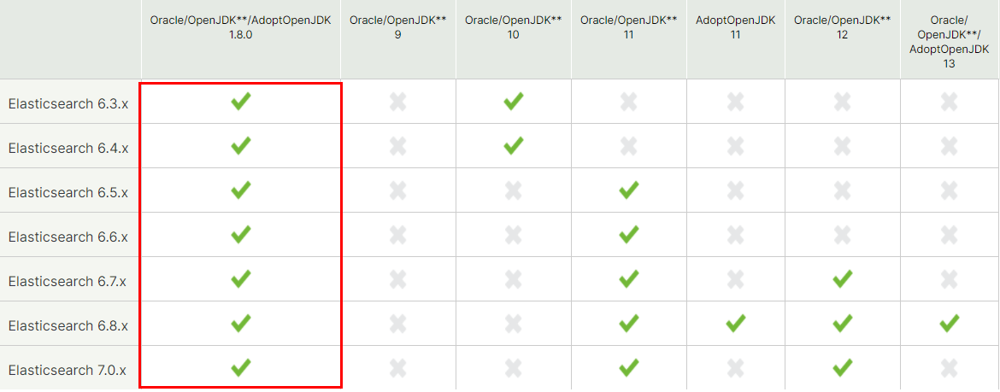
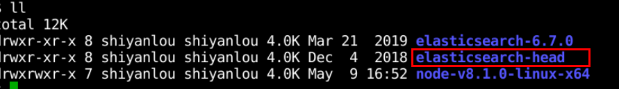

# ELK 日志协议栈组件的安装部署

## 实验介绍

本部分主要介绍 Elasticsearch 、Logstash 和 Kibana 组件的版本选型；以及在 Linux 环境下的安装部署，以及与之相对应的相关插件的安装部署。

#### 知识点

- 学会 Elasticsearch 及其相关插件的安装部署
- 学会 Kibana 组件的安装部署
- 学会 Logstash 组件的安装部署
- 掌握相关 linux 命令

## Elasticsearch 的安装部署

#### Elasticsearch 的版本选择

- Elasticsearch 的版本以及 Elasticsearch 与 JDK 之间的版本一定对应，否则会出现各种报错。因此我们需要参考 ELK 官网上的版本说明，我们根据实际的 JDK 版本来选择对应的 Elasticsearch 版本。

- 首先在 Linux 界面输入如下命令，查询我们已安装的 JDK 版本，如图所示：

```bash
java -version
```


- 然后查看 Elasticsearch 与 JVM 之间的版本对应关系，可参考：[Elasticsearch 与 JVM 之间的版本](https://www.elastic.co/cn/support/matrix#matrix_jvm)。



- 查看 ELK 之间的版本对应关系，可参考：[ELK 的版本](https://www.elastic.co/cn/support/matrix#matrix_compatibility)，如图所示：


- 对应于 JDK 1.8.0 的  ELK 组件的版本有很多，具体参看如下网址：

[Elasticsearch 下载地址为](https://www.elastic.co/cn/downloads/past-releases#elasticsearch)

对于 Elasticsearch 我们选择 6.7.0 版本，如图：


- Elasticsearch 有 windows 版本和 Linux 版本，我们选择 Linux sha 版本进行下载。


#### Elasticsearch 的安装

1. 下载 Elasticsearch 安装包。

- 下面我们在蓝桥云课的环境中进行 Elasticsearch 的安装，但由于官网下载速度比较慢，所以我已经提前在本地给大家下载好了安装包，并上传到了蓝桥云课服务器上，大家只需要在线上使用 wget 命令即可下载到对应的目录中。

```bash
wget https://labfile.oss.aliyuncs.com/courses/1634/elasticsearch-7.8.0-linux-x86_64.tar.gz
```

当进度条达到 100% 时，说明该安装包已经下载到了你所在的目录，如图所示：


输入命令 `ll`,可查看安装包信息，如图所示：


2. 解压该压缩包到指定目录。

- 先创建安装目录

```bash
mkdir install
```

创建的目录如图：


- 解压安装包到指定的 install 目录

```bash
tar -zxf /home/shiyanlou/Code/elasticsearch-6.7.0.tar.gz  -C /home/shiyanlou/Code/install
```


查看 install 目录是否已经有安装文件：


- 安装完成后，各目录如下：


3. 修改配置文件。

- 进入配置文件 config 目录

```bash
cd /home/shiyanlou/Code/install/elasticsearch-6.7.0/config
```

查看该目录下的文件信息：


- 在该 config 目录下创建 logs 目录和 datas 目录

```txt
使用命令 mkdir logs 创建日志目录
使用命令 mkdir datas 创建数据目录
```

如图所示，两个目录已经创建好了。


- 在 config 目录修改 `elasticsearch.yml` 配置文件

```txt
先查询本服务器 的 ip 地址，输入 ifconfig -a 命令
```

linux 的 ip 地址如图所示：


修改内容如下：

```bash
vim elasticsearch.yml
#修改如下内容：
cluster.name: myes
node.name: node01
path.data: /home/shiyanlou/Code/elasticsearch-6.7.0/config/datas
path.logs: /home/shiyanlou/Code/elasticsearch-6.7.0/config/logs
network.host: 10.111.113.196（上一步查出的 ip 地址）
http.port: 9200
transport.host: localhost
transport.tcp.port: 9300

#跨域访问，需添加配置:
http.cors.enabled: true 
http.cors.allow-origin: "*"
```

修改内容如图所示：


- 修改 jvm.option 文件

输入如下命令，根据服务器的内存大小灵活调整 jvm 堆内存大小，如图所示：

```bash
vim jvm.options
-Xms1g
-Xmx1g
```


4. 启动 elasticsearch。

```bash
# 进入 bin  目录
cd /home/shiyanlou/Code/install/elasticsearch-6.7.0/bin
# 输入命令
./elasticsearch 启动 elasticsearch
```

elasticsearch 启动命令如图：


在浏览器中输入 10.111.113.196:9200，页面显示如下，则说明 elasticsearch 安装成功。


或者直接在该 linux 界面输入如下命令：

```bash
curl 10.111.113.196:9200
```

回车，出现如下信息，则说明 elasticsearch 安装成功。


由于 elasticsearch 服务启动之后，访问界面比较丑陋，为了更好的查看索引库当中的信息，我们可以通过安装 elasticsearch-head 插件来实现，这个插件可以更方便快捷的看到 elasticsearch 的管理界面。接下来，我们进行 elasticsearch-head 插件的安装。

#### elasticsearch-head 插件的安装部署

由于 elasticsearch-head 插件是 node.js 实现的，所以需要先安装 node.js。

1. 安装 nodejs 插件。

这里我也是提前下载好了安装包后，上传到服务器，同学们直接采用 wget 命令进行下载。

- 下载 nodejs 到指定目录

```bash
wget https://labfile.oss.aliyuncs.com/courses/1634/node-v8.1.0-linux-x64.tar.gz
```

当进度条达到 100% 时，说明该安装包已经下载到当前目录，如图：


- 解压上述下载的软件包到指定目录

```bash
tar -zxf /home/shiyanlou/Code/node-v8.1.0-linux-x64.tar.gz  -C /home/shiyanlou/Code/install
```


查看该软件包的安装目录，如图：


- 创建软连接

```bash
sudo ln -s /home/shiyanlou/Code/install/node-v8.1.0-linux-x64/lib/node_modules/npm/bin/npm-cli.js /usr/local/bin/npm
sudo ln -s /home/shiyanlou/Code/install/node-v8.1.0-linux-x64/bin/node /usr/local/bin/node
```

进入 `/usr/local/bin` 目录，发现 node 和 npm 都有箭头指向安装目录，说明软连接创建成功，如下图所示：


- 修改环境变量

```bash
sudo vim /etc/profile
# 在其中配置如下路径：
export NODE_HOME=/home/shiyanlou/Code/install/node-v8.1.0-linux-x64
export PATH=:$PATH:$NODE_HOME/bin
export JAVA_HOME=/usr/lib/jvm/java-8-openjdk-amd64
#（本机 jdk 安装目录，可以采用 java -verbose 查看）
export PATH=:$JAVA_HOME/bin:$PATH
```

如图所示：


再输入如下命令,使上述修改的环境变量生效。

```bash
source /etc/profile
```

此时执行以下命令，回车，出现如下图的版本信息，则说明 node.js 配置已生效。

```bash
npm -v
node -v
```


2. 安装 elasticsearch-head 插件。

- 下载安装包到指定目录

```bash
wget https://labfile.oss.aliyuncs.com/courses/1634/elasticsearch-head-compile-after.tar.gz
```

如图，下载进度达到 100% 时，已经将所需安装包下载到当前目录了。


- 解压该安装包

```bash
tar -zxvf /home/shiyanlou/Code/elasticsearch-head-compile-after.tar.gz -C /home/shiyanlou/Code/install/
```

查看该安装包所在目录：



- 修改 `Gruntfile.js`

```bash
cd  /home/shiyanlou/Code/install/elasticsearch-head
vim Gruntfile.js
```

elasticsearch-head 安装目录中的文件：


找到以下代码，添加一行：

```bash
 hostname: `10.111.113.196`
```

如图所示：


修改 `app.js` 文件：

```bash
cd /home/shiyanlou/Code/install/elasticsearch-head/_site
vim app.js
```


将 `this.base_uri` 一行中的 `http` 地址更改为 `10.111.113.196:9200`，如下图所示：


3. 启动 head 服务。

- 启动 elasticsearch-head 插件

```bash
# 进入指定目录
cd /home/shiyanlou/Code/install/elasticsearch-head/node_modules/grunt/bin/
```

进入指定目录如下图所示：


```bash
# 执行以下命令启动 head 插件
 nohup ./grunt server >/dev/null 2>&1 &
```

启动 elasticsearch-head 命令，回车显示进程号，如下图所示：


- 访问 elasticsearch-head 界面

在浏览器输入如下地址：

```txt
http://10.111.113.196:9100
```

此时界面显示如下图所示，则说明 elasticsearch-head 插件安装成功。


## Kibana的安装部署

#### Kibana 的版本选择

- 由于 Elasticsearch 的版本已经确定了下来，那么我们需要参考 ELK 官网上对应的版本说明，我们根据已经装好的 Elasticsearch 版本来确定 Kibana 的版本。
- 参看 Elasticsearch 安装部署中 ELK 的版本对应关系，我们选择 6.7.0 版本，如图所示：


[Kibana 下载地址为：](https://www.elastic.co/cn/downloads/past-releases#kibana)

选择 kibana 6.7.0 版本，点击 Download，如图所示：


在跳转的页面中选择 linux 64-BIT sha 版本下载，如图：


#### Kibana 的安装

下面，我们进入蓝桥云课环境中进行 Kibana 组件的安装。由于环境及网络原因，该安装包我们已经下载好了并上传到了指定的目录，此时同样采用 wget 命令行的方式下载该安装包。

- 下载 kibana 安装包到在指定目录

```bash
wget https://labfile.oss.aliyuncs.com/courses/1634/kibana-6.7.0-linux-x86_64.tar.gz
```

当进度条达到 100% 时，说明安装包已经下载到该目录下了，如图所示：


输入命令 `ll` 查看安装包，如图所示：


- 解压该安装包到指定目录：

```bash
tar -zxf /home/shiyanlou/Code/kibana-6.7.0-linux-x86_64.tar.gz  -C /home/shiyanlou/Code/install
```

进入 install 目录，可以发现 kibana 已经安装完成了，如图所示：


- 修改配置文件 `kibana.yml`

进入 Kibana 配置文件目录，如图：

```bash
cd /home/shiyanlou/Code/install/kibana-6.7.0-linux-x86_64/config/
```


```bash
#输入如下命令
vim kibana.yml

server.host: "10.111.113.196" 
elasticsearch.hosts: ["http://10.111.113.196:9200"]
```

配置上述端口地址，如图：


- 启动 Kibana 服务

```bash
cd /home/shiyanlou/Code/install/kibana-6.7.0-linux-x86_64
nohup bin/kibana >/dev/null 2>&1 &
```

输入上述命令后，回车，显示一个进程号，则说明 kibana 启动成功，如图所示：


- 浏览器输入如下地址访问 Kibana 服务：

```txt
http://10.111.113.196:5601
```

kibana 界面如图所示：


## Logstah 的安装部署

#### Logstash 的版本选择

参看 Elasticsearch 安装部署中 ELK 组件的版本对应关系，我们选择 6.7.0 版本，如图：


[Logstash 组件的下载地址](https://www.elastic.co/cn/downloads/past-releases#logstash)

选择 Logstash 6.7.0 版本：


选择 linux(TAR.GZ sha) 版本下载：


#### Logstash 的安装

下面我们进入蓝桥云课环境进行 Logstash 组件的安装。由于环境和网速原因，我提前在本地给大家下载了该安装包，并上传到了指定服务器上，大家只需要在线上使用 wget 命令即可下载到对应的目录中。

- 下载 Logstash 安装包到指定目录

```bash
#输入如下命令进行下载logstash安装包
wget https://labfile.oss.aliyuncs.com/courses/1634/logstash-6.7.0.tar.gz
```

当进度条达到 100% 时，说明安装包已经下载到该目录下了，如图所示：


查看安装包是否已在本目录，如图：


- 安装 Logstash 组件

```bash
tar -zxf /home/shiyanlou/Code/logstash-6.7.0.tar.gz  -C /home/shiyanlou/Code/install
```

如图，Logstash 组件已经安装完成：


#### Input 插件的配置

1. stdin 标准输入和 stdout 标准输出。

使用标准的输入与输出组件，实现将我们的数据从控制台输入，从控制台输出。

```bash
cd /home/shiyanlou/Code/install/logstash-6.7.0

bin/logstash -e 'input{stdin{}}output{stdout{codec=>rubydebug}}'
```

输入信息 hello ，输出 host，message，version 以及 timestamp 等信息，如图所示：


2. 监控日志文件变化。

Logstash 使用一个名叫 FileWatch 的 Ruby Gem 库来监听文件变化。这个库支持 glob 展开文件路径，而且会记录一个叫 .sincedb 的数据库文件来跟踪被监听的日志文件的当前读取位置。所以，不要担心 logstash 会漏过你的数据。

- 编写脚本，如图所示：

```bash
cd /home/shiyanlou/Code/install/logstash-6.7.0/config

vim monitor_file.conf
#输入如下信息
input{
    file{
        path => "/home/shiyanlou/Code/install/datas/tomcat.log"
        type => "log"
        start_position => "beginning"
    }
}
output{
        stdout{
        codec=>rubydebug
        }
}
```

如图所示：


- 检查配置文件是否可用

```bash
cd /home/shiyanlou/Code/install/logstash-6.7.0/

bin/logstash -f  /home/shiyanlou/Code/install/logstash-6.7.0/config/monitor_file.conf -t
```

成功会出现一下信息：

```txt
 Config Validation Result: OK. Exiting Logstash
```

如图所示：


- 启动该服务

```bash
cd /home/shiyanlou/Code/install/logstash-6.7.0/

bin/logstash -f /home/shiyanlou/Code/install/logstash-6.7.0/config/monitor_file.conf
```

- 发送数据

```bash
#新开 Linux 窗口，创建日志数据目录，如下图1所示：

mkdir -p /home/shiyanlou/Code/install/datas

#通过以下命令发送数据，如下图2所示：

echo "hello logstash" >> /home/shiyanlou/Code/install/datas/tomcat.log

```

图1 创建的日志目录：


图2 在 Logstash 启动的 linux 窗口，显示如下信息：


#### jdbc 插件

jdbc 插件允许我们采集数据库表中的数据到我们的 logstash 当中来。

- 编写脚本

```bash
cd /home/shiyanlou/Code/install/logstash-6.7.0/config

vim jdbc.conf

#输入如下内容：

input {
  jdbc {
    jdbc_driver_library => "/home/shiyanlou/Code/install/mysql-connector-java-5.1.38.jar"
    jdbc_driver_class => "com.mysql.jdbc.Driver"
   # (此处是对应的数据库名)
    jdbc_connection_string => "jdbc:mysql://127.0.0.1:3306/exercise"
    jdbc_user => "root"
    jdbc_password => ""  #mysql没有设置密码

    use_column_value => true
    tracking_column => "tno"
  #  parameters => { "favorite_artist" => "Beethoven" }
    schedule => "* * * * *"
  # 所创建的表名、主键及最后更新
    statement => "SELECT * from courses where tno > :sql_last_value ;"
  }
}

output{
        stdout{
        codec=>rubydebug
        }
}
```

如图所示：


- 上传 mysql 连接驱动包到指定路劲

将 mysql 的连接驱动包下载到我们指定的 `/home/shiyanlou/Code/install/` 路径下，如图所示：


- 创建数据库及表，向相关表中插入数据

```sql
create database exercise;

create table `courses` (
`cno` varchar (30),
`cname` varchar (30),
`tno` varchar (30)
); 

insert into `courses` (`cno`, `cname`, `tno`) values('3-105','计算机导论','825');
insert into `courses` (`cno`, `cname`, `tno`) values('3-220','汽车理论','803');
insert into `courses` (`cno`, `cname`, `tno`) values('3-221','汽车构造','801');
insert into `courses` (`cno`, `cname`, `tno`) values('3-245','操作系统','804');
insert into `courses` (`cno`, `cname`, `tno`) values('6-166','数字电路','856');
insert into `courses` (`cno`, `cname`, `tno`) values('9-888','高等数学','831');

#由于环境中不能显示汉字，只能以该字的 Unicode 码显示，具体可以参看网址 `https://www.bejson.com/convert/unicode_chinese/` 进行查看转码
```

mysql 界面查询刚才插入的数据，如图所示：


- 检查配置文件是否可用：

```bash
cd /home/shiyanlou/Code/install/logstash-6.7.0/

bin/logstash -f /home/shiyanlou/Code/install/logstash-6.7.0/config/jdbc.conf  -t
```

通过之后，显示如下内容：

```txt
Config Validation Result: OK. Exiting Logstash
```

如图所示：


- 启动服务

```bash
cd /home/shiyanlou/Code/install/logstash-6.7.0/

bin/logstash -f /home/shiyanlou/Code/install/logstash-6.7.0/config/jdbc.conf
```

启动后，会有 Successfully started 关键字提示，以及配置文件 jdbc.conf 中的 statement 语句，如图所示：


稍后观察 logstash 界面，发现 logstash 可以对我们数据库表中的数据进行采集，如图所示：


- 继续向数据库表当中添加数据

继续向 mysql 表中插入数据，观看 logstash 界面，发现 logstash 界面能实时更新刚才插入 mysql 的数据，如图所示：

```sql
insert into `courses` (`cno`, `cname`, `tno`) values('9-800','算法导论','839');
```


#### systlog 插件

syslog 机制负责记录内核和应用程序产生的日志信息，管理员可以通过查看日志记录，来掌握系统状况。默认系统已经安装了 rsyslog，直接启动即可。

- 编写脚本

```bash
cd /home/shiyanlou/Code/install/logstash-6.7.0/config

vim syslog.conf
#输入如下内容：
input{
    tcp{
        port=> 6789
        type=> syslog
    }
    udp{
        port=> 6789
        type=> syslog
    }
}

filter{
    if [type] == "syslog" {
        grok {
                match => { "message" => "%{SYSLOGTIMESTAMP:syslog_timestamp} %{SYSLOGHOST:syslog_hostname} %{DATA:syslog_program}(?:\[%{POSINT:syslog_pid}\])?: %{GREEDYDATA:syslog_message}" }
                add_field => [ "received_at", "%{@timestamp}" ]
                add_field => [ "received_from", "%{host}" ]
        }
       date {
             match => [ "syslog_timestamp", "MMM  d HH:mm:ss", "MMM dd HH:mm:ss" ]
           }
    }
}

output{
    stdout{
        codec=> rubydebug
    }
}
```

- 检查配置文件是否可用

```bash
cd /home/shiyanlou/Code/install/logstash-6.7.0

bin/logstash -f /home/shiyanlou/Code/install/logstash-6.7.0/config/syslog.conf -t
```

通过之后，显示如下内容，如图所示：

```txt
Config Validation Result: OK. Exiting Logstash
```


- 启动该服务

执行以下命令启动 logstash 服务

```bash
cd /home/shiyanlou/Code/install/logstash-6.7.0

bin/logstash -f /home/shiyanlou/Code/install/logstash-6.7.0/config/syslog.conf
```

- 发送数据

```bash
#修改系统日志配置文件

sudo vim /etc/rsyslog.conf

#添加一行以下配置

*.* @@10.111.113.196:6789

#重启系统日志服务

sudo systemctl restart rsyslog
```

配置文件如图所示：


#### filter 插件

1. 收集控制台输入数据，采集日期时间出来。

- 开发配置文件

```bash
cd /home/shiyanlou/Code/install/logstash-6.7.0/config/

vim filter.conf

#输入如下内容：
input {
stdin{}
} 
filter {
       grok {

              match => {

"message" => "(?<date>\d+\.\d+)\s+"

               }       
       }       
}       

output {
stdout {codec => rubydebug}
}
```

- 启动 logstash 服务

```bash
cd /home/shiyanlou/Code/install/logstash-6.7.0

bin/logstash -f /home/shiyanlou/Code/install/logstash-6.7.0/config/filter.conf
```

- 控制台输入文字：`yuanyeye yiluzouhao`，如图所示：


2. 使用 grok 收集 nginx 日志数据。

-下载 grok 插件

采用 wget 命令行进行下载，将该 filter 插件包下载到 `/home/shiyanlou/Code/install/logstash-6.7.0` 目录下。

```bash
wget https://labfile.oss.aliyuncs.com/courses/1634/logstash-filter-grok-4.0.4.zip
```


- 采用本地安装

```bash
cd /home/shiyanlou/Code/install/logstash-6.7.0

bin/logstash-plugin install file:///home/shiyanlou/Code/install/logstash-6.7.0/logstash-filter-grok-4.0.4.zip
```

当提示 successful 时，说明安装成功，如图所示：


安装成功之后，可以查看 logstash 的插件列表，如图所示：

```bash
cd /home/shiyanlou/Code/install/logstash-6.7.0/

bin/logstash-plugin list
```


- 开发 logstash 的配置文件

定义 logstash 的配置文件如下，我们从控制台输入 nginx 的日志数据，然后经过 filter 的过滤，将我们的日志文件转换成为标准的数据格式。

```bash
cd/home/shiyanlou/Code/install/logstash-6.7.0/config

vim monitor_nginx.conf

#输入如下内容：
input {
stdin{}
}

filter {
grok {
match => {
"message" => "%{IPORHOST:clientip} \- \- \[%{HTTPDATE:time_local}\] \"(?:%{WORD:method} %{NOTSPACE:request}(?:HTTP/%{NUMBER:httpversion})?|%{DATA:rawrequest})\" %{NUMBER:status} %{NUMBER:body_bytes_sent} %{QS:http_referer} %{QS:agent}"
         }
     }
}

output {
stdout{codec => rubydebug}
} 
```

- 启动该 logstash 服务

```bash
cd /home/shiyanlou/Code/install/logstash-6.7.0

bin/logstash -f /home/shiyanlou/Code/install/logstash-6.7.0/config/monitor_nginx.conf
```

启动成功，提示 Successfully 信息，如图所示：


- 从控制台输入 nginx 日志文件数据：

输入第一条数据：

```txt
36.157.150.1 - - [05/Nov/2018:12:59:27 +0800] "GET /phpmyadmin_8c1019c9c0de7a0f/js/messages.php?lang=zh_CN&db=&collation_connection=utf8_unicode_ci&token=6a44d72481633c90bffcfd42f11e25a1 HTTP/1.1" 200 8131 "-" "Mozilla/5.0 (Windows NT 6.1; WOW64) AppleWebKit/537.36 (KHTML, like Gecko) Chrome/45.0.2454.101 Safari/537.36"
```

最终经转换成的标准数据，输出如图所示结果：


输入第二条数据：

```txt
36.157.150.1 - - [05/Nov/2018:12:59:28 +0800] "GET /phpmyadmin_8c1019c9c0de7a0f/js/get_scripts.js.php?scripts%5B%5D=jquery/jquery-1.11.1.min.js&scripts%5B%5D=sprintf.js&scripts%5B%5D=ajax.js&scripts%5B%5D=keyhandler.js&scripts%5B%5D=jquery/jquery-ui-1.11.2.min.js&scripts%5B%5D=jquery/jquery.cookie.js&scripts%5B%5D=jquery/jquery.mousewheel.js&scripts%5B%5D=jquery/jquery.event.drag-2.2.js&scripts%5B%5D=jquery/jquery-ui-timepicker-addon.js&scripts%5B%5D=jquery/jquery.ba-hashchange-1.3.js HTTP/1.1" 200 139613 "-" "Mozilla/5.0 (Windows NT 6.1; WOW64) AppleWebKit/537.36 (KHTML, like Gecko) Chrome/45.0.2454.101 Safari/537.36"
```

最终经转换成的标准数据，输出如图所示结果：


#### Output 插件

1. 标准输出到控制台。

将我们收集的数据直接打印到控制台，执行以下命令：

```bash
cd /home/shiyanlou/Code/install/logstash-6.7.0

bin/logstash -e 'input{stdin{}}output{stdout{codec=>rubydebug}}'
```

输入数据 `yuanlao yiluzouhao`，输出结果如图所示：


2. 将采集数据保存到 file 文件中。

logstash 也可以将收集到的数据写入到文件当中去永久保存，接下来我们来看看 logstash 如何配置以实现将数据写入到文件当中。

- 开发 logstash 的配置文件

```bash
cd /home/shiyanlou/Code/install/logstash-6.7.0/config

vim output_file.conf
#输入如下内容
input {
    stdin{}
}

output {

   file {

       path => "/home/shiyanlou/Code/install/datas/%{+YYYY-MM-dd}-%{host}.txt"

        codec => line {

           format => "%{message}"

       }
       flush_interval => 0
   }
}

```

- 检测配置文件并启动 logstash 服务

```bash
cd /home/shiyanlou/Code/install/logstash-6.7.0/
```

检测配置文件是否正确

```bash
bin/logstash -f config/output_file.conf -t
```

成功后显示如下结果：

```txt
 Config Validation Result: OK. Exiting Logstash
```

如图所示：


- 启动服务，然后从控制台输入一些数据：

```bash
bin/logstash -f config/output_file.conf
```

启动服务后，输入下数据，如图所示：


查看文件写入的内容，如图所示：

```bash
cd /home/shiyanlou/Code/install/datas

cat 2021-05-23-localhost.txt
```

该文件中内容就是我们刚才输入的信息，如图所示：


3. 采集数据保存到 elasticsearch。

- 开发 logstash 的配置文件

```bash
cd /home/shiyanlou/Code/install/logstash-6.7.0/config

vim output_es.conf

#输入如下内容

input {stdin{}}
output {
    elasticsearch {
        hosts => ["10.111.113.196:9200"]
        index => "logstash-%{+YYYY.MM.dd}"
    }
}
```

这个 index 是保存到 elasticsearch 上的索引名称，如何命名特别重要，因为我们很可能后续根据某些需求做查询，所以最好带时间。因为我们在中间加上 type，就代表不同的业务，这样我们在查询当天数据的时候，就可以根据类型+时间做范围查询。

- 检测配置文件并启动 logstash

检测配置文件是否正确

```bash
cd /home/shiyanlou/Code/install/logstash-6.7.0

bin/logstash -f config/output_es.conf -t
```

成功后显示如下结果，如图所示：

```txt
 Config Validation Result: OK. Exiting Logstash
```


启动 logstash （需先启动 elasticsearch 和 elasticsearch-head 插件）

```bash
bin/logstash -f config/output_es.conf
```

在控制台中输入如下几条数据，如图：


在 elasticsearch 当中查看数据：


## 实验总结

ELK 各组件版本一定对应，且必须选择对应的 JDK 版本，否则会出现各组件不兼容的现象。ELK 日志协议栈各组件安装部署相对简单，主要是几个插件的问题，容易出纰漏。另外，本课程中涉及到的几个 linux 命令一定要掌握。
